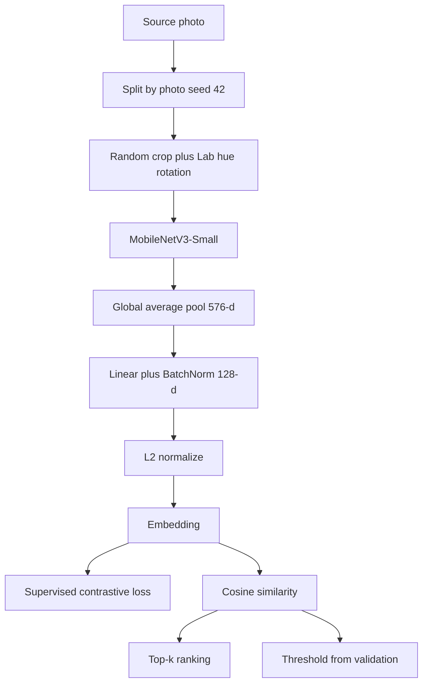

# Architecture

This is a color-invariant saree design matcher. Given one photo of a saree, it finds other photos of the same motif even when the palette is different, and it says whether two photos are the same design.

It is an image-retrieval system, the same shape of problem as face recognition. It is not a classifier with a fixed list of saree classes. The network maps each crop to a point in a 128-dimensional space. Same motif, different hue: those points stay close. Different motif, even in the same hue: those points stay far. Ranking and the yes/no decision are both cosine similarity on those points.

There is no web server in this repo. "Live" means two things: a public Kaggle notebook a reviewer can open, and a local command that scores one query photo against a folder of known designs.

## What the data actually is

The Drive corpus used here is `data/sarees/handloom_sarees`: 165 JPEGs. Filenames look like `h_img_34590.jpg`. They contain no design id and no colorway label. The sibling folder `normal_sarees` was empty. The Kaggle Indian-saree set labels weave categories (Ikat, Banarasi, Pichwai, Bandhani). Those are not "design 42 in red and in blue," so that set is not used.

Because real colorways are absent, each source photo is one design. A second palette is a rotation of the Lab chroma axes `(a, b)` in `src/color.py`. Lightness stays where it was, so the motif edges stay put and only the hue changes. The evaluation says this plainly. These numbers are not a claim about real mill colorways that were never in the release.

The photos are proprietary. They stay in `data/`, which is gitignored. Do not commit them, do not put them in the notebook, and delete the folder when the exercise is over.

## System map



| Piece | File | Role |
|---|---|---|
| Download | `src/download.py` | Pulls the public Drive folder into `data/sarees`. |
| Color | `src/color.py` | Lab hue rotation and same-palette recoloring. |
| Data | `src/data.py` | Photo-level split, crops, training batches. |
| Model | `src/model.py` | MobileNetV3-Small plus the 128-d head. |
| Loss | `src/loss.py` | Supervised contrastive loss. |
| Train | `src/train.py` | PK batches, cosine learning-rate schedule, checkpoint. |
| Metrics | `src/metrics.py` | Rank-1, Rank-5, mAP, ROC-AUC, EER. |
| Eval | `src/eval.py` | Held-out identification, verification, stress test, ImageNet baseline. |
| Efficiency | `src/efficiency.py` | Parameter count, FLOPs, latency. |
| Infer | `src/infer.py` | One query against a gallery folder. |

## The encoder

`SareeEncoder` in `src/model.py` starts from torchvision `mobilenet_v3_small` with ImageNet-1K weights. That initialization is disclosed. The ImageNet classifier is discarded.

The forward pass is:

1. The convolutional trunk (`net.features`).
2. Global average pool, which produces a 576-d vector.
3. A bias-free linear layer and a batch-norm, 576 to 128.
4. L2 normalization, so the vector has length 1.

After that normalization, cosine similarity is a dot product. Retrieval does not need a second network.

`forward_backbone` skips the projection and L2-normalizes the 576-d pooled vector. That path is only the frozen ImageNet baseline. A random untrained projection would measure the head, not the pretrained features.

The submitted checkpoint is `runs/color/best.pt`, saved at epoch 40. Measured on Apple GPU (`runs/color/efficiency.json`):

| | |
|---|---|
| Parameters | 1,000,992 (1.0M) |
| Conv and linear multiply-adds | 0.11 GFLOPs |
| Embedding | 128 |
| Input | 1×3×224×224 |
| Latency | 4.96 ms per image, batch size 1 |

## How color invariance is trained

Color is not removed. Many motifs in this corpus are hue contrast on a similar ground, such as a purple flower and a gold flower on cream. Grayscale or an edge map would erase that contrast. The network learns to ignore palette because the training distribution changes palette on purpose.

Each batch holds P designs and K views of each. The defaults are P = 16 and K = 4, so a batch is 64 crops. The label inside the batch is the design index.

For every view:

- Random resized crop to 224, scale 0.55 to 1.0.
- Horizontal flip with probability 0.5.
- Mild Gaussian blur with probability 0.2.
- No vertical flip and no 90° rotation. A saree motif has an orientation, and those turns invent a pattern the cloth does not have.

When color augmentation is on (the default):

- View 0 of every design in the batch shares one random hue, with a small saturation jitter. Different motifs in that shared palette are negatives. The model cannot treat "this red" as the identity of the design.
- The other views take an independent hue on the full circle, saturation scaled between 0.6 and 1.4. Fifteen percent of those views only jitter hue by ±20°, so the original palette is still seen.

The loss is supervised contrastive loss at temperature 0.07 (`src/loss.py`). Every other view of the same design is a positive. Every view of a different design is a negative. The embedding is already L2-normalized, so the logits are dot products divided by the temperature. The self-comparison is dropped by zeroing it in the denominator. Writing negative infinity into the logits produces NaN on Apple GPU, which is why the mask is a multiply rather than a fill.

The optimizer is AdamW, learning rate 3e-4, weight decay 1e-4, with a cosine schedule over 40 epochs. After each epoch the validation photos are embedded twice: gallery at hue +40°, query at hue +160°. The checkpoint with the best validation Rank-1 is `best.pt`.

`--no-color-aug` trains the same architecture with the palette step turned off. That run is `runs/nocolor`. It is the ablation that shows the hue rotation is doing the work.

## Split

`split_designs` in `src/data.py` shuffles photos with seed 42 and cuts 60% train, 20% validation, 20% test. On 165 photos that is 99 / 33 / 33. A crop and a recoloring of one file never sit on opposite sides of the cut. Reported metrics never embed the training photos.

A protocol that trains on the red and green of one design and tests on a real blue of that same design cannot be run. The release has no such pairs. The test that does run is stricter about memorizing a file and honest about color: the photo is held out, and inside that photo the gallery palette and the query palette do not overlap.

## Evaluation

`python -m src.eval --checkpoint runs/color/best.pt` writes `runs/color/eval.json`.

Cross-palette identification:

- Gallery: resize so the short side is handled by a 360px resize, then the center 224 crop, Lab hue +40°.
- Query: the same field, shifted 48 pixels and mirrored, Lab hue +160°.
- Both crops are the body of the cloth. Opposite corners of one photo are often the border and the field, and those are not a positive pair.
- The shift and the mirror stop a pixel-for-pixel copy from matching.
- One relevant gallery item per query. Rank-1, Rank-5, and mAP. With one relevant item, average precision is 1 divided by the rank of that item.

Verification:

- Positive pairs are query i with gallery i.
- Negative pairs are query i with every other gallery row.
- ROC-AUC and equal-error rate do not depend on a chosen threshold.
- The operating threshold is the equal-error threshold fit on validation, then applied to test. For the color model that threshold is 0.67. Above it, the pair is called the same design.

Same-palette stress test:

- Every gallery crop is recolored so its dominant hue matches that query (`palette_match`).
- Rank-1 here is the claim that the motif matched, not the shared color.

`python -m src.eval --imagenet` repeats the same crops, hues, and split with the frozen ImageNet trunk. No fine-tuning, no projection. The result is `runs/imagenet/eval.json`.

Held-out test, 33 designs, synthetic palettes:

| Model | Rank-1 | Rank-5 | mAP | ROC-AUC | EER | Same-palette Rank-1 |
|---|---|---|---|---|---|---|
| Color-trained, `runs/color` | 90.9% | 100% | 95.5% | 0.992 | 3.0% | 90.9% |
| No palette change, `runs/nocolor` | 63.6% | 90.9% | 77.7% | 0.968 | 9.1% | 87.9% |
| Frozen ImageNet backbone | 66.7% | 97.0% | 80.4% | 0.944 | 15.2% | 90.9% |

At the validation threshold, the color model accepts 97.0% of true test pairs and 4.2% of impostor pairs.

## How a live query works

Identification, from `src/infer.py`:

1. Load `runs/color/best.pt`.
2. Open the query photo, take the center 224 crop, ImageNet-normalize it. This path does not rotate the hue. It scores the photo as it is.
3. Embed every image in the gallery folder the same way, skipping the query file itself.
4. Dot product, sort descending, print the top k.

```bash
python -m src.infer --query data/sarees/h_img_34590.jpg --topk 5
```

The gallery embeddings are computed on each call. At 165 images and a few ms each, that is under a few seconds on CPU (under a second on GPU), and it does not need an approximate index. A later gallery of hundreds of thousands of images is the point where FAISS would matter. It is not used here.

Verification is the same embedding and a threshold. Two photos are the same design when their cosine similarity is at least 0.67, the equal-error threshold from validation. The eval report also prints the true-accept rate and the false-accept rate of that threshold on the test split, so the cutoff is measured rather than picked by eye.

`notebooks/submission.ipynb` is the walkthrough that calls these modules. It checks that the approach note is at most 500 characters, counts the split, loads the checkpoints (and trains only if a checkpoint is missing), reprints the three eval rows, draws three cross-palette retrieval strips, and reprints the efficiency numbers. The strips use the eval crops: query at hue +160°, gallery hits at hue +40°.

## Make it live for the reviewer

The assignment form wants a public notebook. The self-contained one is `notebooks/deeplure_saree.ipynb`. It writes the source into the Kaggle session and downloads the Drive folder at runtime.

1. Open [Kaggle](https://www.kaggle.com/), New Notebook, File, Import Notebook, and choose `notebooks/deeplure_saree.ipynb`.
2. Settings: Internet On, Accelerator GPU, Visibility Public.
3. Save & Run All.
4. Copy the public notebook URL into https://forms.gle/1fJaAFbuTS4FdhQn9.

Do not upload `data/`. The notebook downloads the corpus itself. ImageNet weights download from torchvision on that first run, which is why Internet must be on.

To reproduce the same stack on a machine:

```bash
python3.12 -m venv .venv
source .venv/bin/activate
pip install -r requirements.txt
python -m src.download
python -m src.train --data data/sarees --out runs/color
python -m src.train --data data/sarees --out runs/nocolor --no-color-aug
python -m src.eval --checkpoint runs/color/best.pt
python -m src.eval --checkpoint runs/nocolor/best.pt
python -m src.eval --imagenet
python -m src.efficiency --checkpoint runs/color/best.pt
python -m src.infer --query data/sarees/h_img_34590.jpg --topk 5
```

The color and no-color checkpoints in `runs/` are already trained. Those two `train` commands are only needed on a machine that does not have `best.pt`. Training uses CUDA if it is present, otherwise Apple GPU, otherwise CPU.

The approach note for the form, 444 characters:

MobileNetV3-Small maps a 224px crop to a 128-d L2-normalized embedding. Each photo is one design. Positives are its crops under Lab hue rotation and saturation change; other designs in the batch are negatives. Supervised contrastive loss, PK sampling, flip and mild blur. Cosine similarity ranks the gallery and verifies pairs. ImageNet initialization, disclosed. Real colorway labels are absent, so palettes are synthetic and the eval says so.
